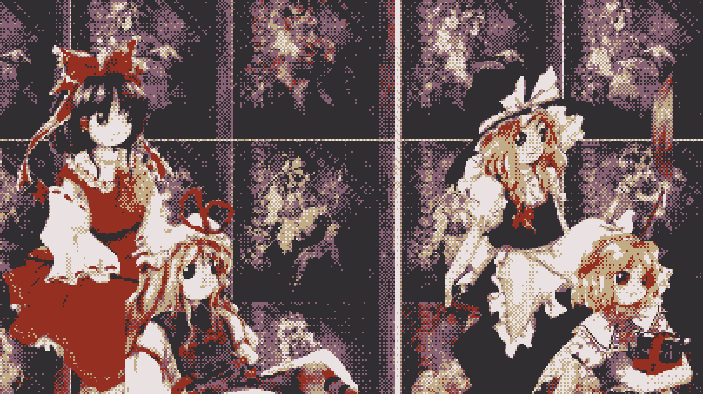

# dither-lab

A browser-based dithering tool for generating dithered gradients and processing images with classic and modern algorithms.



## Features

### Dithering Algorithms
- **Ordered**: Bayer 2x2, 4x4, 8x8
- **Error Diffusion**: Floyd-Steinberg, Jarvis-Judice-Ninke, Stucki, Atkinson, Burkes, Sierra, Sierra Two-Row, Sierra Lite
- **Stochastic**: Blue Noise
- **None**: Nearest-color quantization (no dithering)

### Gradient Generator
- 6 gradient shapes: Linear, Radial, Conic, Diamond, Square, Spiral
- 4 color space interpolation modes: RGB, HSL, OKLab, OKLCH
- Multi-stop gradients with configurable positions
- Seamless wrapping for conic/spiral gradients

### Image Processing
- Drag-and-drop or file picker image upload
- Palette extraction algorithms: Median Cut, K-Means, Octree, Popularity
- Preset hardware palettes: CGA, Game Boy, Commodore 64, NES, PICO-8
- Generated palettes: Uniform RGB, Grayscale, Monochrome, Sepia, Web Safe

### Controls
- Adjustable color count, dither scale, and transition strength
- Gamma correction toggle
- Custom palette editor
- Presets and random generation
- PNG/SVG/HTML export

## Tech Stack

Vite + React + TypeScript

## Development

```bash
npm install
npm run dev
```

## Building

```bash
npm run build
```
